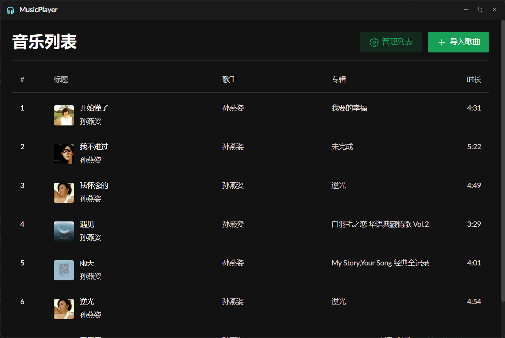
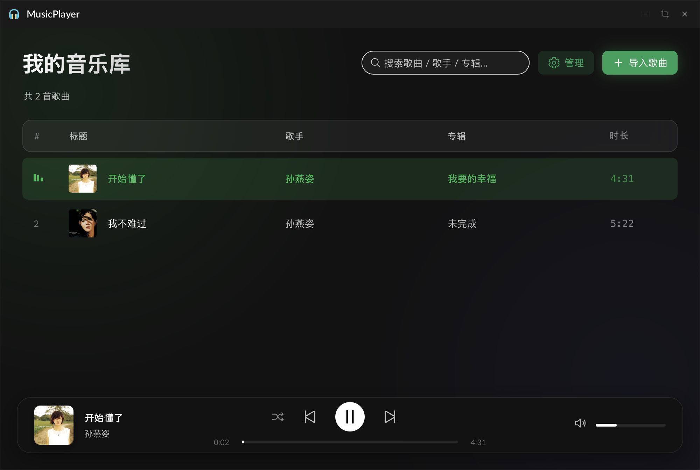
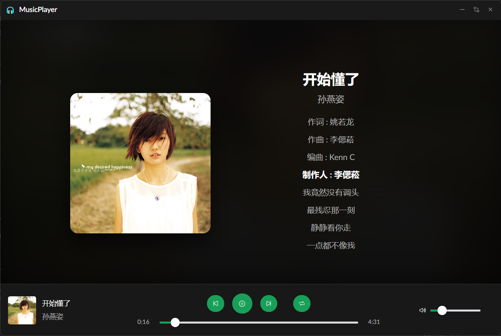

# MusicPlayer
一个基于 Tauri + Vue3 构建的本地轻量级音乐播放器。

> **注意**: 本项目已从 Electron 全面重构为 Tauri 框架，以获得更小的体积和更好的性能。
> - **Tauri 版本 (当前主推)**: 采用 Rust 后端，安装包体积仅 ~10MB。
> - **Electron 版本**: 原有 Electron 代码已归档至 `electron` 分支。

## 效果演示






在 MusicPlayer 中，你可以导入自己的本地音乐。
并按照你的喜好来移动歌曲在列表中的顺序。
在播放时可以选择随机播放与顺序播放。
> 温馨提示：歌词需要在联网状态下才能加载 (支持网易云音乐/QQ音乐源)

# 快速开始

## 前置要求
开发 Tauri 应用需要 Rust 环境。如果尚未安装，请运行：
```bash
curl --proto '=https' --tlsv1.2 -sSf https://sh.rustup.rs | sh
```

## 安装与运行

安装依赖
```bash
npm install
```

开发运行
```bash
npm run dev
```

## 打包
```bash
npm run build
```
